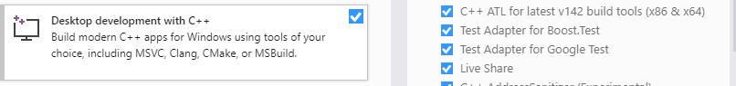
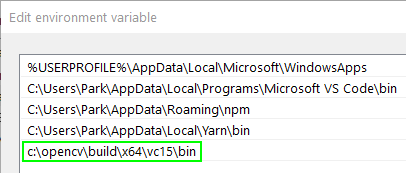

# Sign_Lang_AI

Sign Language AI is a project build for CSC211H class at BMCC

CSC211H_Honors_Project_Ahmed_Soliman_Fall2020

## Requirements:

- Visual Studio Community
  - Download & install Visual Studio 2019 Community Editor [- Here](https://visualstudio.microsoft.com/downloads/)
  - Select Desktop development with C++ and leave all settings as default and then click install
  - 
- OpenCV
  - Download prebuilt OpenCV Current Version used 4.5.0 [- Here](https://opencv.org/releases/)
  - Extract openCV Library to C:\
  - 
- Windows 10 Operating system platform (64-bit)
  - Add OpenCV to windows environment path
  - 

## Visual Studio Setup Steps:

Complete visual studio setup steps [- Here](https://sites.google.com/view/sign-language-ai/setup)

```
Create a project in visual studio
```

- Choose console app then configure the project settings

```
Set platform target to x64
```

- Pre-built binaries are built for x64 Windows platforms.

```
Add to Include Directories.
```

- Tell the compiler how the OpenCV library looks. This is done by providing a path to the header files (build/include)

```
Add to Library Directories.
```

- Tell the linker where it can find the lib files for different modules.

```
Add Additional Dependencies — List .lib files for different modules.
```

- Note that we’re only going to list a single all-in-one file named opencv_world.

## What is the problem:

Communication is a way of sharing our thoughts, ideas, and feelings with others. Verbal and Non-Verbal are the two modes of communication. Usually, everyone communicates with each other verbally. But speech impaired people cannot communicate with each other verbally. Then they communicate with everyone else via sign language which is a Non Verbal mode of communication. Most prominently this method is used by mute and deaf people.

COVID-19 pandemic changed the way we communicate, learn, and receive education virtually. Deaf and mute people face a hard time communicating with other people for daily needs, tasks, and supplies. The deaf-mute people all over the world use sign language as a medium between them and others for communication. However, only people who have gone under special training can understand sign language to communicate with them. This leads to a big gap between the deaf-dumb community and everyone else.

## How Technology can help:

Sign language is a language that consists of body movements, especially of hand and arms, some facial expressions, and some special symbols for alphabets and numbers. We as non-disabled people are not able to decode those sign gestures. Technology can help in decoding the alphabets and translating them into words or sentences. There should be a system that acts as a mediator between mute-def people and everyone else. So the proposed system aims at converting those sign gestures into text/speech that can be understood by everyone. So this Automated Sign To text/speech conversion system helps in decoding those symbols without the need of an expert person who understands the sign language.

## The Idea:

Usually, a sign language interpreter is used by deaf people to seek help for translating their thoughts to all of us. My prototype will help in identifying the alphabet and give the output in a text format. Later these alphabets can be used to form sentences. The model helps the muted people to communicate with everyone and express themselves. This not only makes their life emotionally better but also makes their life easier in the post covid-19 pandemic in communication and seeking help from medical professionals. As well as they become more employable and independent. It also becomes a lot easier for everyone to understand the muted people who would in-turn be able to help them.

## Architecture:


The proposed system uses the Convolutional Neural Network (CNN) architecture. CNN network consists of different layers that process the input alphabets and symbols and produces the desired output. I’m working on creating a model that can help society in a broader way by bridging the communication gap between Deaf-Muted people and everyone else. I propose a system, acting as an interface between the Deaf-mute community and non-deaf people based on American Sign Language (ASL). The speech Conversion system helps in decoding those symbols without the need of an expert person who understands sign language.

The feature detection is done using various contour analysis and feature extraction built in the OpenCV Library. The hand feature detection is taken through any type of camera or webcam connected to a computer which is then processed into a binary image upon which contour analysis is done and to optimize such actions using OpenCV functions.

The extracted feature is then passed into the neural network algorithms which process the feature through various layers and predict a single output which is then mapped to a text file.

One of the most important objectives of the model is to decrease the communication gap between hearing-impaired people and everyone else and use this technology to its best in order to smooth integration of these differently-abled people in our society.

# Challenges:

## Capture

- The camera should have resolution of at least 320 x 320
- the frames should be captured at a rate of 30fps
- No image corruption should happen
- A new image should be captured once the system has processed and extraceted the sign from the previous image.

## Train

- Images should be saved as png images for the distance function to work
- The system should have a feature to allow new users to train the letters.
- There should be no overwriting of a letter refrence image with another letter during traning.
- The images should be stored in a subfolder/dataset for maintainance.

## Detection

- Image should be converted into grayscale image and hand should be detected using contour analysis and extraction.
- System is better to be trained before extraction and detection.
- Runing the system in real time using C++ classes std::threads.

## Threshold

- Threshold for the colors is as below:
- BLACK: (0, 0, 0)
- WHITE: (255, 255, 255)
- RED: (0, 0, 255)
- GREEN: (0, 255, 0)
- BLUE: (255, 0, 0)
- YELLOW: (255, 255, 0)

# What I learned:

- How to use visual studio as an IDE for developing projects
- Learned a lot about OpendCV library and framework for image processing
- How to Use Background Subtraction Methods in OpenCV
- Understanding findcontours() function from OpenCV
- Understanding the difference between is Mat, vector and IplImage in OpenCV
- Including external framework and open OpenCV libraries to the visual studio project

## Future Scope

- Future enhancement of the system can be done through enhancing the system that can detect the hand gesture in real time with a more accuracy mesusres.
- The system can interpret words and stores it in a database or a text file which later can be used to create snectences. The system can also be integrated into other operating systems or devices which will help to convert sign languge to text.
- This project was developed with a limited knowledge of C++ and openCV. But there is unlimetied opprtunities to make it better.

#### COPYRIGHTS -> AHMED SOLIMAN
